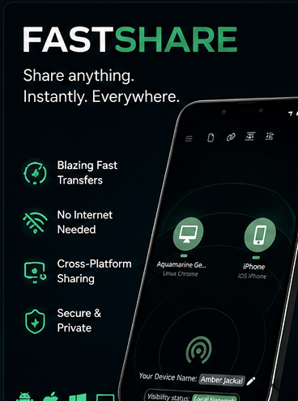
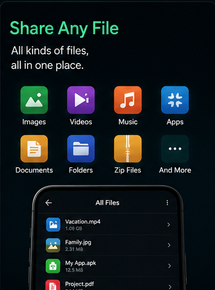
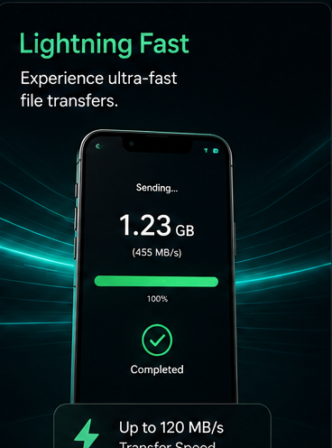
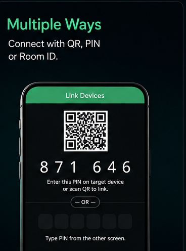
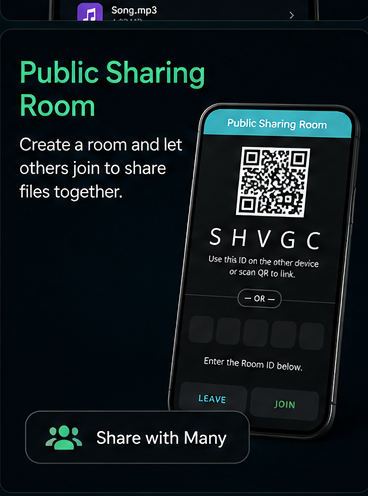
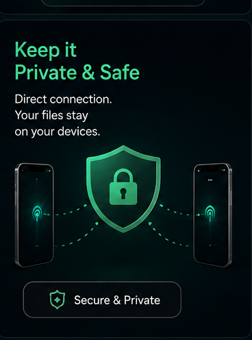

# 📱 FastShare Android App

<div align="center">
  
  
  **The official native Android App for FastShare**

  [](https://github.com/ritikthakur22/fastshare_app/releases/latest)
</div>

<div align="center">
  <h2>🌟 Introducing FastShare Pro</h2>
  
</div>

---

## 📸 Screenshots

<p align="center">
  
  
  
</p>
<p align="center">
  
  
  
</p>

---

This is the native Android application wrapper for **FastShare**, a seamless, ultra-fast method to share files and clipboard across devices. 

While FastShare runs beautifully in any web browser, this Android app wraps the FastShare web application into a fully native experience using **Capacitor**.

## ✨ App Exclusive Features
- **Native File Downloads**: Bypasses browser restrictions to securely save files natively into your device's `Downloads` or `Pictures` folders utilizing the Android MediaStore API.
- **Chunked File Transfer**: Advanced chunked native transfer system that efficiently saves massive files without crashing the WebView.
- **Material Theme Engine**: Dynamically customize the entire app's material UI color theme right from the sidebar using handcrafted presets. Fully synchronizes with the Android native status bar.
- **Native Notifications**: Fully integrated with Android's notification system.
- **Standalone Experience**: Install FastShare as an app directly on your phone without relying on browser UI.

## 🌐 Custom Signaling Server (Self-Hosting)

FastShare relies on a central **Signaling Server** to help devices find each other and establish a secure, peer-to-peer WebRTC connection. Once connected, files are transferred directly between devices and never touch the server.

By default, FastShare uses our public signaling server hosted on Render (`wss://fastshare-ja1a.onrender.com`). **For most users, simply leave the "Signaling Server URL" setting blank.** The app will automatically connect and work seamlessly out of the box.

### Why use a custom server?
Privacy-conscious users or corporate networks can self-host the FastShare backend on their own hardware (like a Raspberry Pi, NAS, or local server). 
1. Run the backend using Node.js or Docker on your local network.
2. Open the FastShare settings on your devices.
3. Enter your local server's WebSocket URL (e.g., `ws://192.168.1.50:3000`) in the **Signaling Server URL** field.

This allows FastShare to work **entirely offline** without an internet connection, provided the devices are connected to the same local router.

## 🚀 Why FastShare? (FastShare vs PairDrop / Snapdrop)

While FastShare is inspired by the amazing work of PairDrop and Snapdrop, it introduces major architectural improvements and exclusive features making it far more advanced:

- **True Native Android App**: Unlike a standard PWA web wrapper, FastShare's Android app uses custom native Capacitor plugins. It natively interfaces with the Android MediaStore API to download files directly into your `Downloads` and `Pictures` folder, completely bypassing the browser's storage and memory limits.
- **Chunked File Transfers**: Typical WebRTC web apps crash when transferring large files due to RAM limits. FastShare implements an advanced chunked transfer system. It splits files into smaller pieces and stitches them together natively, allowing for **massive (Gigabyte+) file transfers** without crashing the app or running out of memory.
- **Advanced Theming Engine**: FastShare isn't just a simple dark/light mode toggle. It includes a dynamic Material Theme engine. You can change the entire application's color palette on the fly, and the Android App will instantly synchronize the native OS status bar to match your custom theme.
- **Improved Connection & Standalone Experience**: FastShare operates as a powerful standalone tool with native Android notifications and performance optimizations that bridge the gap between web and native technologies, providing a much more robust local network sharing experience.

## 🔗 Links


- **Main Web App**: [https://fastshare.ritikthakur.com.np](https://fastshare.ritikthakur.com.np)
- **FastShare Core Source Code**: [ritikthakur22/FastShare](https://github.com/ritikthakur22/FastShare)
- **My Portfolio**: [ritikthakur.com.np](https://ritikthakur.com.np)

### Human-Centric Intelligent Engineering

A human-driven engineering approach enhanced by intelligent computational assistance throughout the software development lifecycle, with human judgment governing architecture, implementation, validation, and final outcomes.


## 🛠️ Build it yourself

To build the app yourself, you need Android Studio and Node.js.

```bash
git clone https://github.com/ritikthakur22/fastshare_app.git
cd fastshare_app

npm install
npx cap sync android


# Build the app using Android Studio
```
